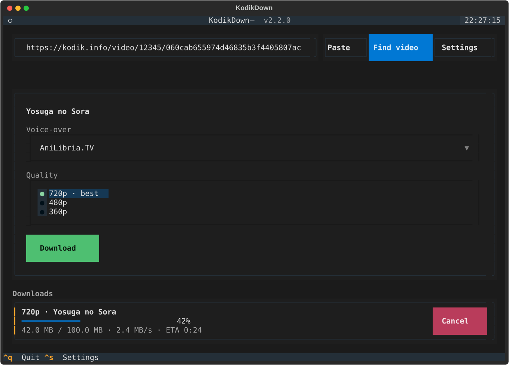

# KodikDown

[](https://github.com/SHAWNiksDev/kodikdown/actions/workflows/ci.yml)
[](LICENSE)

A terminal app that turns Kodik player links into downloaded video files.
Paste a link (a whole `<iframe>` tag works too), pick a quality, hit download.
No browser, no Chromium, no devtools digging.



Works on Linux and Windows.

## Why I rewrote it

The first version of this tool launched a headless Chromium through Playwright,
loaded the player in an iframe, blindly clicked around the page and hoped an
`.m3u8` URL would fly by. It worked, but it dragged ~150 MB of browser along
and broke whenever the player layout changed.

It turns out none of that is needed. The player page itself contains everything:
video id and hash in the HTML, and the API endpoint hidden in a base64 string
inside the player's JS bundle. KodikDown talks to that endpoint directly,
decodes the obfuscated stream links (Caesar cipher + base64) and hands them to
yt-dlp. The whole thing is a few hundred KB of logic instead of a browser.

## Features

- Accepts bare player URLs, protocol-relative ones, or a copied `<iframe>` tag
- Shows every quality the server actually offers (typically 360p–720p)
- Downloads via yt-dlp: parallel HLS fragments, retries, resume-friendly
- Live progress, speed and per-download cancel in the TUI
- Download folder setting persists per user
- One-shot CLI mode for scripts: `kodikdown download <url>`
- Sensible file names taken from the player page title, sanitized for Windows

## Install

Grab a ready binary from [Releases](https://github.com/SHAWNiksDev/kodikdown/releases)
(`kodikdown-linux-x86_64` or `kodikdown-windows-x86_64.exe`) and run it — that's it.

Or from source (Python 3.11+):

```bash
pip install .
kodikdown
```

## Usage

Run `kodikdown` with no arguments for the interface:

1. Paste a player link or iframe embed
2. **Find video** picks out the title and available qualities
3. Choose a quality and hit **Download** — progress shows up below
4. `Ctrl+S` opens settings (download folder), `Ctrl+Q` quits

For scripts and one-off downloads there is a CLI:

```bash
kodikdown download "https://kodik.info/video/91873/060c.../720p" -q 720 -o ~/Videos
kodikdown download "<url>" --list-qualities   # just show what the server has
kodikdown download "<url>" --print-url -q 480  # print the direct manifest URL
```

Settings live in the standard config location (`~/.config/kodikdown/settings.json`
on Linux, `%LOCALAPPDATA%\kodikdown` on Windows).

## How it works

For the curious, the whole lookup is four HTTP requests:

1. `GET` the player page → extract `type`, `id`, `hash` and the player bundle path
2. `GET` the player JS bundle → the API endpoint sits behind `atob("...")`
3. `POST` `{type, id, hash}` to that endpoint → JSON with per-quality links
4. Each link is rotated back through a 26-shift Caesar cipher and base64-decoded
   into a direct HLS manifest, which goes straight to yt-dlp

The endpoint path changes once in a while, so it is never hard-coded — it is
discovered from the live bundle on every lookup and cached per domain.

## Development

```bash
pip install -e '.[dev]'
pytest          # 57 tests, includes a real HLS download through a local server
ruff check src tests
ruff format --check src tests
mypy            # strict mode
```

## Building binaries

PyInstaller one-file builds for both platforms run automatically on `v*` tags
(see `.github/workflows/release.yml`) and land in GitHub Releases. To build
locally:

```bash
pyinstaller --onefile --name kodikdown --paths src src/kodikdown/__main__.py
```

## License

MIT. Use responsibly and only with content you have the rights to — this tool
is a player client, not a license to pirate.

---

# KodikDown (по-русски)

Консольное приложение, которое превращает ссылки на плеер Kodik в скачанные
видеофайлы. Вставляете ссылку (можно целиком тег `<iframe>`), выбираете
качество, жмёте «Скачать». Никакого браузера и Chromium — приложение общается
с API плеера напрямую.


## Возможности

- Понимает обычные ссылки, ссылки без протокола и вставленные теги `<iframe>`
- Показывает все качества, которые реально отдаёт сервер (обычно 360p–720p)
- Скачивание через yt-dlp: параллельные фрагменты HLS, ретраи, докачка
- Живой прогресс, скорость и отмена каждой загрузки в интерфейсе
- Папка для сохранения сохраняется между запусками
- Режим командной строки для скриптов: `kodikdown download <ссылка>`
- Осмысленные имена файлов из названия плеера, безопасные для Windows

## Установка

Скачайте готовый бинарник со страницы
[Releases](https://github.com/SHAWNiksDev/kodikdown/releases) и просто
запустите его. Либо из исходников (нужен Python 3.11+):

```bash
pip install .
kodikdown
```

## Как пользоваться

Запустите `kodikdown` без аргументов:

1. Вставьте ссылку на плеер или iframe-код
2. **Найти видео** — приложение покажет название и доступные качества
3. Выберите качество и нажмите **Скачать** — прогресс появится внизу
4. `Ctrl+S` — настройки, `Ctrl+Q` — выход

Для разовых задач есть CLI:

```bash
kodikdown download "https://kodik.info/video/91873/060c.../720p" -q 720 -o ~/Видео
kodikdown download "<ссылка>" --list-qualities   # только показать качества
kodikdown download "<ссылка>" --print-url -q 480  # напечатать прямую ссылку
```

## Как это устроено

Весь поиск ссылки — четыре HTTP-запроса: со страницы плеера берутся `type`,
`id` и `hash`; из JS-бандла плеера через `atob()` достаётся адрес API; POST
с этими тремя полями возвращает JSON со ссылками по качествам; каждая ссылка
восстанавливается обратным шифром Цезаря и base64 и отдаётся yt-dlp. Адрес
эндпоинта периодически меняется, поэтому он каждый раз заново извлекается
из живого бандла и кэшируется по домену.

## Разработка

```bash
pip install -e '.[dev]'
pytest
ruff check src tests
mypy
```

Сборка бинарников под Linux и Windows запускается автоматически по тегу `v*`
и публикуется в Releases.

## Лицензия

MIT. Пользуйтесь ответственно и только с тем контентом, на который у вас есть
права — это клиент плеера, а не разрешение пиратствовать.
