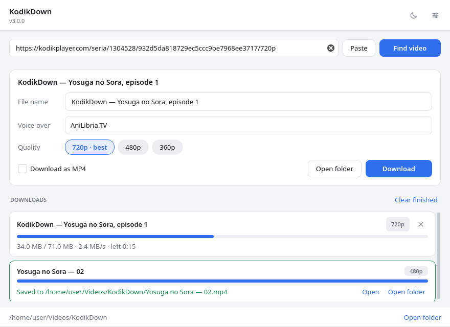
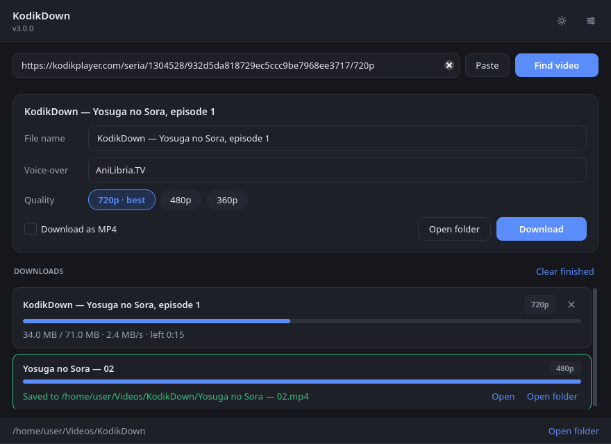

# KodikDown

[](https://github.com/SHAWNiksDev/kodikdown/actions/workflows/ci.yml)
[](LICENSE)

A small desktop app for Windows and Linux that turns Kodik player links into
downloaded video files. Paste a link (a whole `<iframe>` tag works too), pick a
voice-over and a quality, hit download. No browser, no Chromium, no devtools. See the
[changelog](CHANGELOG.md) for what changed in each release.



## Features

- Accepts bare player URLs, protocol-relative ones, copied `<iframe>` tags and
  links from dead mirrors — the resolver retries the working Kodik hosts
- Shows every quality the server actually offers (typically 360p–720p) and all
  voice-overs of the video, selectable per download
- Editable file name, taken from the player page when it has one
- Downloads through yt-dlp: parallel HLS fragments, retries, resume-friendly,
  plus an optional direct MP4 when the CDN serves one
- Live progress with size, speed and ETA; cancel any transfer on its own
- Several downloads at once, finished ones stay listed with *Open* and
  *Open folder*
- Light and dark themes, following the system by default
- English and Russian interface, auto-detected and switchable
- Scriptable CLI for one-off downloads



## Install

Grab a binary from [Releases](https://github.com/SHAWNiksDev/kodikdown/releases):

| File | What it is |
| --- | --- |
| `kodikdown-windows-x86_64.exe` / `kodikdown-linux-x86_64` | the desktop app |
| `kodikdown-windows-x86_64-cli.exe` / `kodikdown-linux-x86_64-cli` | the CLI, no window |

Or from source (Python 3.11+):

```bash
pip install .
kodikdown              # the window
kodikdown <link>       # the window, with the lookup already running
kodikdown-cli download "<url>"   # the CLI
```

The binaries have no runtime dependencies. yt-dlp uses its built-in HLS
downloader, and Kodik serves fMP4 fragments that it assembles without help.
If `ffmpeg` happens to be on `PATH`, yt-dlp will use it to remux streams that
need it (some mirrors still serve MPEG-TS).

## Usage

1. Paste a player link or iframe embed, press **Enter**
2. **Find video** reads the title, the voice-overs and the available qualities
3. Adjust the file name if you like, choose a voice-over and a quality
4. **Download** — progress shows up in the list below, each transfer has its
   own cancel button

Keyboard: `Enter` looks up the link in the field (or cancels a lookup in
progress), `Esc` cancels a lookup, `Ctrl+S` opens settings, `Ctrl+Q` quits.

For scripts there is a CLI:

```bash
kodikdown-cli download "https://kodikplayer.com/seria/1304528/<hash>/720p" -q 720 -o ~/Videos
kodikdown-cli download "<url>" --list-qualities      # just show what the server has
kodikdown-cli download "<url>" --list-translations   # numbered voice-over list
kodikdown-cli download "<url>" -t AniLibria -q 720   # pick a voice-over by name or number
kodikdown-cli download "<url>" --mp4 -q 480          # plain MP4 instead of HLS
kodikdown-cli download "<url>" --print-url -q 480    # print the direct manifest URL
```

Exit codes: `2` unrecognized link, `3` page or stream error, `4` network
error, `5` download failed, `6` requested voice-over not found, `130`
cancelled.

Settings live in the standard config location (`~/.config/kodikdown/settings.json`
on Linux, `%LOCALAPPDATA%\kodikdown` on Windows) and store the download folder,
language, theme, number of parallel downloads and the MP4 preference.

## How it works

For the curious, a lookup is three HTTP requests:

1. `GET` the player page → the video `type`, `id`, `hash` and the signed
   `urlParams` block (referer, domain and their signatures), plus the
   voice-over list
2. `GET` the player JS bundle → the API endpoint sits behind `atob("...")`
3. `POST` the signed fields to that endpoint → JSON with per-quality links

Each link is rotated back through a Caesar cipher and base64-decoded into a
direct HLS manifest, which goes straight to yt-dlp. The signatures are minted
per page view and expire quickly, so every lookup fetches a fresh page and
links are used immediately; the endpoint address is discovered from the live
bundle and cached per host.

Kodik's `kodik.info` domain was lost to a squatter and the player now lives on
`kodikplayer.com`, so links are resolved against a list of known mirrors when
the host in the link no longer answers.

## Troubleshooting

- **"Network or server problem"** — Kodik may be down, or the machine cannot
  reach any of the mirrors. Check `https://kodikplayer.com` in a browser.
- **A warning about a proxy link** — the CDN rate-limited your IP and served a
  proxied stream. It works, but slower; wait a few minutes for full speed.
- **Nothing downloads** — check that the download folder is writable; the app
  reports the exact path it tried.

## Development

```bash
pip install -e '.[dev]'
pytest                              # offline tests, including a real HLS download
ruff check src tests && ruff format --check src tests
mypy                                # strict mode
```

The Qt tests run headless through the `offscreen` platform plugin, which
`tests/conftest.py` selects automatically. To see the window while developing:

```bash
python -m kodikdown.gui
```

## Building binaries

PyInstaller recipes for both platforms live in `packaging/`:

```bash
pyinstaller packaging/kodikdown.spec --noconfirm      # desktop app
pyinstaller packaging/kodikdown-cli.spec --noconfirm  # CLI
```

`.github/workflows/release.yml` builds both for Linux and Windows on `v*` tags
and attaches them to the GitHub release.

## License

MIT. Use responsibly and only with content you have the rights to — this tool
is a player client, not a license to pirate.

---

# KodikDown (по-русски)

Небольшое десктопное приложение для Windows и Linux, которое превращает
ссылки на плеер Kodik в скачанные видеофайлы. Вставьте ссылку (можно целиком
тег `<iframe>`), выберите озвучку и качество, нажмите «Скачать». Никакого
браузера и Chromium — приложение общается с API плеера напрямую.
Что менялось в каждой версии — в [changelog](CHANGELOG.md).


## Возможности

- Понимает обычные ссылки, ссылки без протокола, вставленные теги `<iframe>`
  и ссылки с уже умерших зеркал — резолвер сам перебирает живые хосты Kodik
- Показывает все качества, которые реально отдаёт сервер (обычно 360p–720p),
  и все озвучки видео с выбором для каждой загрузки
- Имя файла можно изменить; по умолчанию берётся со страницы плеера
- Скачивание через yt-dlp: параллельные фрагменты HLS, ретраи, докачка,
  а при наличии — прямая ссылка на MP4
- Живой прогресс с объёмом, скоростью и оставшимся временем, отмена каждой
  загрузки отдельно
- Несколько загрузок одновременно; завершённые остаются в списке с кнопками
  «Открыть» и «Открыть папку»
- Светлая и тёмная темы, по умолчанию как в системе
- Русский и английский интерфейс: определяется сам, переключается в настройках
- Режим командной строки для скриптов


## Установка

Скачайте готовый файл со страницы
[Releases](https://github.com/SHAWNiksDev/kodikdown/releases): приложение
(`kodikdown-linux-x86_64` / `kodikdown-windows-x86_64.exe`) или консольную
версию (`…-cli`). Либо из исходников (нужен Python 3.11+):

```bash
pip install .
kodikdown
kodikdown-cli download "<ссылка>"
```

Бинарникам ничего не нужно для работы: yt-dlp скачивает HLS своим встроенным
загрузчиком, а Kodik отдаёт fMP4-фрагменты, которые собираются без
посторонней помощи. Если `ffmpeg` есть в `PATH`, yt-dlp задействует его для
пересборки потоков, которым это нужно (некоторые зеркала до сих пор отдают
MPEG-TS).

## Как пользоваться

1. Вставьте ссылку на плеер или iframe-код и нажмите **Enter**
2. **Найти видео** покажет название, озвучки и доступные качества
3. При желании поправьте имя файла, выберите озвучку и качество
4. **Скачать** — прогресс появится в списке ниже, у каждой загрузки своя
   кнопка отмены

Горячие клавиши: `Enter` — найти видео по ссылке в поле (или отменить поиск),
`Esc` — отменить поиск, `Ctrl+S` — настройки, `Ctrl+Q` — выход.

Для разовых задач есть CLI:

```bash
kodikdown-cli download "https://kodikplayer.com/seria/1304528/<hash>/720p" -q 720 -o ~/Видео
kodikdown-cli download "<ссылка>" --list-qualities      # только показать качества
kodikdown-cli download "<ссылка>" --list-translations   # нумерованный список озвучек
kodikdown-cli download "<ссылка>" -t AniLibria -q 720   # озвучка по имени или номеру
kodikdown-cli download "<ссылка>" --print-url -q 480    # напечатать прямую ссылку
```

Коды выхода: `2` — ссылка не распознана, `3` — ошибка страницы или потоков,
`4` — сетевая ошибка, `5` — загрузка не удалась, `6` — озвучка не найдена,
`130` — отменено.

Настройки лежат в стандартном месте (`~/.config/kodikdown/settings.json` в
Linux, `%LOCALAPPDATA%\kodikdown` в Windows): папка загрузок, язык, тема,
число одновременных загрузок и предпочтение MP4.

## Как это устроено

Весь поиск — три HTTP-запроса: со страницы плеера берутся `type`, `id`,
`hash` и подписанный блок `urlParams` (referer, домен и их подписи), а также
список озвучек; из JS-бандла плеера через `atob()` достаётся адрес API; POST
с подписанными полями возвращает JSON со ссылками по качествам. Каждая
ссылка восстанавливается обратным шифром Цезаря и base64 и отдаётся yt-dlp.

Подписи одноразовые и быстро устаревают, поэтому страница запрашивается
заново перед каждым обращением к API, а ссылки сразу уходят в загрузку.
Адрес эндпоинта периодически меняется, поэтому он извлекается из живого
бандла и кэшируется на время сессии. Домен `kodik.info` был потерян, плеер
переехал на `kodikplayer.com`, поэтому при недоступном хосте ссылка
пробуется на известных зеркалах.

## Лицензия

MIT. Пользуйтесь ответственно и только с тем контентом, на который у вас есть
права — это клиент плеера, а не разрешение пиратствовать.
